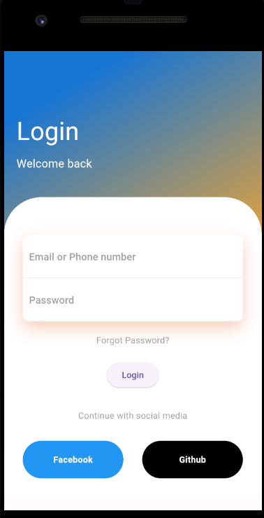
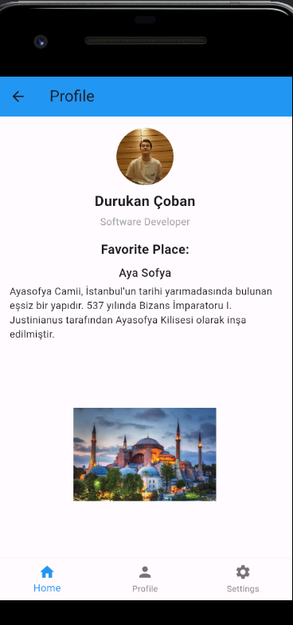
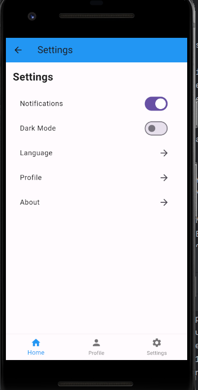

# Travel Now App

Travel Now is a Flutter application designed to provide users with a seamless experience in exploring travel destinations, leaving comments, rating places, and managing preferences. With features like user authentication, browsing destinations, leaving comments, and personalized profile management, Travel Now aims to enhance your travel planning process.

## Features

### User Authentication
- Sign up and log in securely to access the app's features.

### Browse Destinations
- Explore various travel destinations with images and descriptions.
- Click on destinations to view detailed information.

### Leave Comments
- Share your experiences by leaving comments on different travel destinations.
- Engage with other users' comments and feedback.

### Rate Places
- Rate travel destinations with a simple 5-star rating system.
- Provide feedback to help other users make informed decisions.

### Profile Management
- Access your personalized profile page.
- View your favorite travel destinations and comments.

### Settings
- Customize your app experience with settings such as dark mode and language preferences.

## Screenshots

*Login Screen*

*Home Screen*

*Profile Screen*

*Settings Screen*

*Comment Screen*

## Getting Started

To get started with Travel Now, follow these steps:

1. Clone this repository to your local machine.
2. Install Flutter and Dart on your development environment.
3. Set up the necessary dependencies.
4. Replace placeholder data with your own travel destinations and images.
5. Customize the app to fit your preferences and requirements.

If you want to access the final stable build, check out the `stable/final` branch in the repository.

## Dependencies

- Flutter

## Contributing

Contributions to Travel Now are welcome! If you find any bugs or have suggestions for improvements, please open an issue or submit a pull request.

## License

This project is licensed under the MIT License - see the [LICENSE](LICENSE) file for details.

## Acknowledgments

Special thanks to the Flutter community for their invaluable resources and support in building this application.
